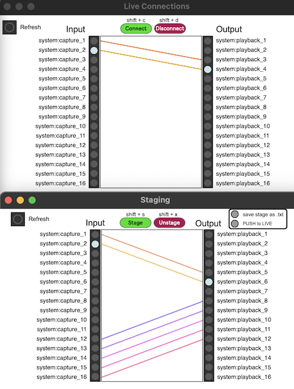

# maxtrip

Maxtrip is a Jack audio control interface developed for Max. The patch allows you to run a Jack server, and connect to others over JackTrip via a shell in Max! Save and recall connections while staging your next setup, allowing for dynamic routing on the fly.

>[!NOTE]
>Maxtrip is currently only for macOS and assumes a coreaudio device is being used. This may be expanded in the future for more accessibility!

### Jack Control & Staging
Maxtrip allows for full control over routing between inputs and outputs, and includes shortcuts for quick routing between connections. 

Current connections can be saved in text files via the ***staging*** module. These files allow for quick visual parsing of saved connections from previous sessions, and can be recalled to either append to, or replace the current connections.

New target connection graphs can be established in the background without disrupting the current connections. This allows an operator to prepare future connections and push these to the live graph when desired.

*Live connection graph (top) and staging connection graph (bottom)*

Staging walkthrough: [[YouTube]](https://www.youtube.com/watch?v=sYuNwJXmKe8)

### Recording

Maxtrip includes a ***session recording*** module which can help capture input stereo singals from Jack into Max. Generate a desired amount of stereo recording strips and patch audio to a desired input audio device. 

## Dependencies

Please ensure that you've installed both [Jack](https://jackaudio.org/downloads/) and [Jacktrip](https://github.com/jacktrip/jacktrip) to your `/usr/local/bin`.

Additionally, Maxtrip requires [Shell](https://github.com/jeremybernstein/shell) and [Jasch Objects](https://www.jasch.ch/dl/) externals for Max.

## Discussion / Issues

If you'd like to show how you're using MaxTrip in your work, have an idea, or come across a bug/issue, please use the respective tabs above! 

## Read More

DisPerSion Lab Documentation: [[dispersionlab.org - maxtrip]](https://dispersionlab.org/sub_projects/maxtrip/)

Audio Mostly 2021 paper: 
[[Research Gate]](https://www.researchgate.net/publication/355358864_A_Technological_and_Methodological_Ecosystem_for_Dynamic_Virtual_Acoustics_in_Telematic_Performance_Contexts),
[[ACM Digital Library]](https://dl.acm.org/doi/abs/10.1145/3478384.3478425) 
> Hoy R., D. Van Nort, “A Technological and Methodological Ecosystem for Dynamic Virtual Acoustics in Telematic Performance Contexts”, in Proc. of Audio Mostly, 2021.
